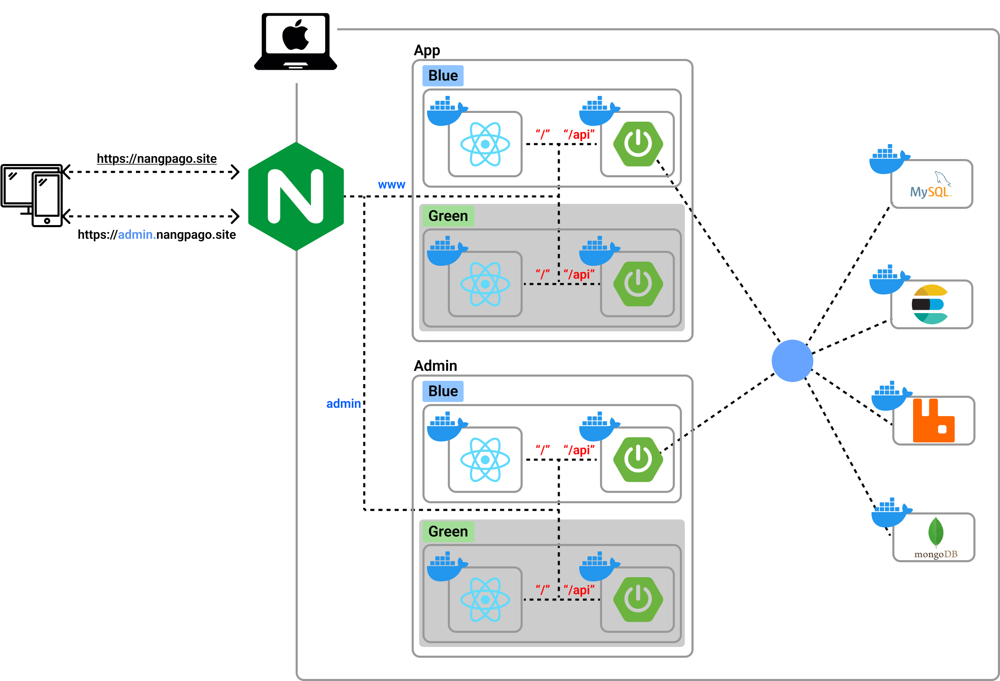
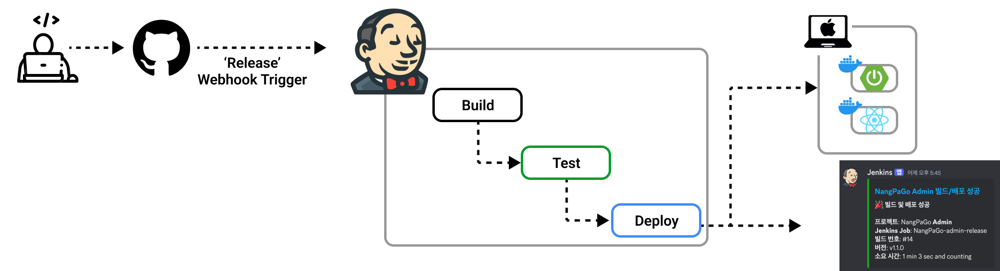

# NangPaGo

<div>
   


## 👋 소개

냉장고 속 남은 재료로 무엇을 요리할지 고민되시나요?  
**냉파고**는 냉장고 속 재료를 활용할 수 있는 레시피를 추천해주는 웹 애플리케이션입니다.

### 🛠️ 사용 기술

**Backend**


**Database & Storage**


**Search Engine & Message Broker**


**DevOps & Infrastructure**

-000000?style=for-the-badge&logo=macos&logoColor=white)


**Frontend**


## 🕒 프로젝트 기간

2024.12.17 ~ 2025.02.13 **(2개월)** 


## 🎯 프로젝트 목적

- ElasticSearch 기반 자연어 검색 및 자동완성 기능 구현
- 직관적인 UI/UX를 통한 Seamless User Experience 제공
- RabbitMQ를 활용한 비동기 처리로 시스템 확장성 및 성능 향상
- SSE(Server-Sent Events) 기반 실시간 알림 시스템 구현
- GitHub Actions와 Jenkins를 활용한 CI/CD 파이프라인 구축으로 안정적인 배포 환경 조성
- 관리자 대시보드를 통한 사용자 활동 모니터링 및 서비스 분석 기능 제공


## 📈 기대효과

**사용자 편의성 증대**  
- 자연어 검색, 오타 허용, 초성/중성 분리를 통한 정확한 검색 결과 제공.

**협업 효율성 개선**  
- CI/CD 파이프라인 구축으로 배포 과정 자동화 및 안정성 확보.
- Docker 및 GitHub Actions 활용으로 개발 및 운영 간 경계를 최소화.

</div>

---

## 📋 주요 기능

### 🔑 사용자 인증
- **사용자 인증**: OAuth 2.0을 활용한 안전한 사용자 인증.

### 🗂 마이페이지
- **프로필 관리**: 닉네임 변경 및 중복 확인 기능 제공.
- **냉장고 관리**: 사용자가 저장한 재료 확인 및 레시피 제공.
- **활동 내역**: 좋아요, 즐겨찾기한 레시피와 작성 댓글 기록 확인.

### 🔍 레시피 검색 및 추천
- **재료 기반 검색**: 사용자가 입력한 재료를 바탕으로 레시피 추천.
- **자연어 처리**: 오타, 초성/중성 분리를 통해 정교한 검색 지원.
- **세부 정보 제공**: 상세 조리 과정과 영양 정보 표시.

### 🧊 냉장고 관리
- **식재료 등록**: 사용자가 보유한 재료를 등록 및 관리.
- **자연어 처리**: 오타, 초성/중성 분리를 통해 정교한 검색 지원.
- **레시피 추천**: ElasticSearch를 활용한 맞춤형 레시피 제공.

### 📖 레시피/커뮤니티 조회페이지
- **회원 맞춤 서비스**: 회원/비회원 분리된 레시피 추천 리스트 제공.
- **게시물 관리**: 커뮤니티 게시물 공개/비공개 설정 및 비회원 접근 제한.

### 👥 커뮤니티
- **게시물 관리**: 작성, 수정, 삭제, 조회 기능 지원.
- **댓글 소통**: 사용자 간 댓글을 통한 소통 지원.

---


## 🤝 협업 방법 워크플로우

### 협업 도구


### 워크플로우
- 작업 관리: Jira를 활용해 작업 티켓 생성 및 상태 추적.
- 문서 관리: Confluence에 프로젝트 설계 및 기술 문서 기록.
- CI/CD 파이프라인: GitHub Actions로 빌드, 테스트, 배포 자동화.
- 코드 리뷰: PR 작성 및 최소 1명 이상의 승인 후 병합.

---

## 서버 아키텍처
### 배포 URL: https://nangpago.site




## 📊 데이터셋 및 전처리
레시피 데이터셋
출처: 식품의약품안전처 조리식품 레시피 DB
데이터 전처리:
- 정규화식을 통한 전처리, 불필요한 열 제거 및 null 값 처리.
- 재료 리스트를 ElasticSearch에 최적화된 형태로 변환.

## 레시피 추천 흐름
- 사용자가 보유한 재료 입력.
- ElasticSearch에서 해당 재료를 포함한 레시피 검색.
- 정렬 및 필터링 후 사용자가 선호할 만한 결과 반환.

---

## 배포 환경

- **CI/CD 파이프라인 구성:**
  - PR 생성 시 자동 Build/Test 수행.
  - Release 버전이 생성되면 자동으로 Docker 컨테이너 배포.
- **Docker Compose 활용:**
  - Backend, Frontend, DB, ElasticSearch 모두 컨테이너화.

---


## 📄 프로젝트 구조
```yaml
.
├── NangPaGo-be/ # 백엔드
├── NangPaGo-fe/ # 프론트엔드
└── NangPaGo-data/ # 데이터 처리
